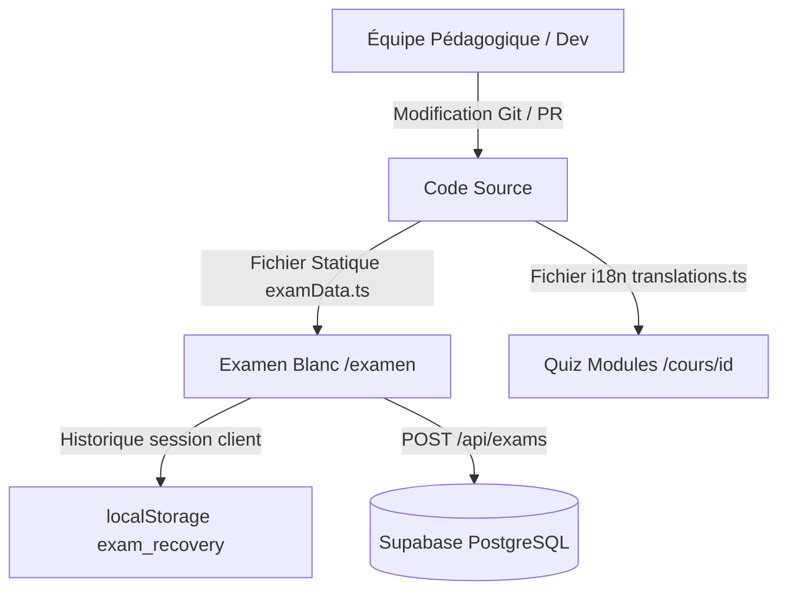

# Spécifications Fonctionnelles & Architecture : Système de Questions (Question Bank)

> **Rôle** : Architecte Logiciel Senior & Expert EdTech
> **Projet** : Le Volant Pour Tous
> **Objectif** : Structurer, rationaliser et unifier la gestion des questions de code de la route pour garantir la cohérence technique et pédagogique entre le mode d'apprentissage (Quiz de module) et le mode d'évaluation (Examen blanc).

---

## 🎯 Étape 1 — Question Bank (Source de Vérité)

Pour une V1 simple, performante et sans surcoût d'infrastructure, l'architecture repose sur une **Question Bank sous forme de fichiers statiques fortement typés et localisés** (traduits).



### 1. D'où viennent les questions ?
Les questions proviennent de deux dépôts statiques structurés :
- **Quiz de module** : Définis de manière localisée dans `lib/translations.ts` sous les clés `quiz.modules.[theme].[index]`.
- **Examens blancs** : Définis dans `lib/examData.ts` (pour les métadonnées et la configuration des questions d'examen) couplés aux assets physiques d'illustrations (`/public/images/exam/`).

### 2. Qui les crée et les maintient ?
- **Création** : L'équipe pédagogique conçoit les situations, les choix de réponses et les explications.
- **Maintenance (V1)** : Les développeurs intègrent ces questions directement dans le code source via Git. Toute mise à jour de contenu (coquille, correction réglementaire) fait l'objet d'un commit et d'un déploiement continu via Vercel.
- **Évolution (V2)** : Une table `Question` en base de données avec une interface d'administration Supabase pour modifier le catalogue à la volée.

### 3. Comment sont-elles stockées ?
En V1, elles sont importées en mémoire côté serveur ou client à partir des fichiers TypeScript `lib/examData.ts` et `lib/quizData.ts`. La traduction en russe et français est gérée réactivement via le contexte d'internationalisation.

---

## 🎯 Étape 2 — Modèle de données des questions

Afin d'unifier la structure des questions entre les quiz et les examens, nous définissons un modèle de données cible unique.

### 2.1 Modèle TypeScript Unifié
Chaque question (qu'elle appartienne à un quiz ou à un examen blanc) doit respecter cette interface :

```typescript
export type ETGTheme =
  | 'signalisation'
  | 'priorites'
  | 'circulation'
  | 'vitesse'
  | 'securite'
  | 'alcool'
  | 'mecanique'
  | 'eco_conduite'
  | 'premiers_secours'
  | 'partage_route';

export interface Question {
  id: string;                // UUID ou ID unique (ex: "q-101")
  themeEtg: ETGTheme;        // L'un des 10 thèmes officiels
  difficulty: 'A' | 'B' | 'C'; // A: Facile, B: Moyen, C: Difficile (utile pour le ciblage)
  image?: string;            // Optionnel : URL/Chemin de la mise en situation réelle
  
  // Contenu textuel localisé (récupéré à la volée via la langue active)
  question: string;          // Énoncé bilingue
  options: string[];         // Tableau de 3 ou 4 options de réponse
  correctAnswers: number[];  // Tableau d'indices des réponses correctes (ex: [0] pour A, [0, 2] pour A+C)
  explanation: string;       // Explication pédagogique avec rappel de la règle
}
```

### 2.2 Schéma de Données Prisma (Modèle de rechange pour persistance BDD)
Si l'on souhaite stocker les questions en base de données pour permettre une mise à jour dynamique sans redéploiement :

```prisma
model Question {
  id             String   @id @default(cuid())
  themeEtg       String   // Mapping avec l'enum ETGTheme
  difficulty     String   @default("facile")
  image          String?
  
  // Champs multilingues
  questionFr     String
  questionRu     String
  optionsFr      String[] // ex: ["Oui", "Non"]
  optionsRu      String[] // ex: ["Да", "Нет"]
  
  // Indices des bonnes réponses (stocké sous forme de tableau d'entiers)
  correctAnswers Int[]
  
  explanationFr  String
  explanationRu  String
  
  createdAt      DateTime @default(now())
  updatedAt      DateTime @updatedAt

  @@index([themeEtg])
}
```

---

## 🎯 Étape 3 — Logique Quiz vs Examen Blanc

Bien que partageant le même modèle de données sous-jacent, le Quiz et l'Examen Blanc répondent à deux objectifs pédagogiques et contraintes techniques distincts :

| Caractéristique | Quiz de Fin de Module (`/cours/[id]`) | Examen Blanc (`/examen`) |
| :--- | :--- | :--- |
| **Objectif Pédagogique** | Valider l'apprentissage immédiat d'un cours. | Évaluer l'élève dans les conditions de l'ETG officiel. |
| **Sélection des Questions** | **Ciblée** : Uniquement les questions associées au module du cours. | **Mélangée** : Répartition selon la grille officielle des thèmes. |
| **Nombre de Questions** | 5 à 12 questions. | **Exactement 40 questions**. |
| **Gestion du Temps** | Pas de limite de temps. | **Chronomètre strict de 20s par question**. |
| **Répétition / Tirage** | Séquentiel et identique à chaque lecture. | Tirage pseudo-aléatoire selon les quotas réglementaires. |
| **Explication / Correction** | Immédiate après chaque question pour l'apprentissage. | Différée (Revue d'erreurs en fin d'examen et sur le dashboard). |
| **Seuil de Réussite** | **80%** de bonnes réponses (ex: 4/5). | **87.5%** de bonnes réponses (au moins 35/40). |

### 1. Règle de répartition réglementaire d'un Examen Blanc (40 questions)
Chaque session d'examen génère un tirage respectant strictement la répartition officielle du Code de la Route français :
1. *Circulation routière* : 8 questions
2. *Le conducteur* : 8 questions
3. *La route* : 4 questions
4. *Les autres usagers* : 4 questions
5. *Réglementation générale* : 4 questions
6. *Équipements de sécurité* : 3 questions
7. *Mécanique & équipements* : 3 questions
8. *Premiers secours* : 2 questions
9. *Précautions en quittant le véhicule* : 2 questions
10. *Environnement & éco-conduite* : 2 questions

### 2. Algorithme anti-répétition
Pour garantir la pertinence de l'évaluation :
- Les questions déjà réussies lors des 2 dernières sessions d'examen sont exclues du tirage.
- Les questions récemment échouées (présentes dans la file d'attente de la "Revue d'erreurs" du Dashboard) ont une probabilité de tirage augmentée de 50%.

---

## 🎯 Étape 4 — Contradictions à corriger (Alignement)

L'audit des spécifications existantes et du code source révèle trois incohérences qu'il convient d'aligner :

### 1. Accès Invité vs Connecté (Examen Blanc)
- **Contradiction** : La spécification d'Examen Blanc (`feature-spec-examen.md`) indique : *"Les visiteurs invités ont le droit d'effectuer un examen d'évaluation."* Cependant, la route API `/api/exams/route.ts` retourne un code d'erreur `401 Unauthorized` si l'utilisateur n'est pas authentifié avec Supabase.
- **Résolution** :
  - L'accès à l'Examen Blanc est **autorisé** aux visiteurs invités (sans compte) pour **une seule tentative**.
  - Le résultat de cette évaluation (score final et erreurs) est temporairement stocké dans le `localStorage` de l'invité sous la clé `guest_exam_result`.
  - Lors de la création de compte ou de la connexion ultérieure de l'élève, l'application détecte cette clé, transmet les données au serveur via `POST /api/exams` pour les rattacher à son compte, puis supprime la clé locale.

### 2. Persistance `localStorage` vs Base de Données
- **Contradiction** : Risque de conflit et d'écrasement de données si l'étudiant révise alternativement en mode connecté et déconnecté.
- **Résolution** :
  - **Single Source of Truth réactive** : L'état global de la progression est géré par le hook React `useProgress()`.
  - Si l'élève est connecté, toutes les lectures et écritures transitent par les API endpoints (`/api/progress`). Les données sont alors persistées dans PostgreSQL.
  - Si l'élève est déconnecté, la progression est stockée en local.
  - **Règle de fusion (Merge Algorithm)** : À l'authentification, les identifiants des modules complétés locaux et cloud sont fusionnés par **Union d'ensembles** (tous les modules validés en local ou sur le cloud sont conservés). Pour les quiz, seul le score le plus élevé pour chaque module est retenu.

### 3. Enregistrement des erreurs (`mistakes`) défaillant
- **Contradiction** : Le client transmet le tableau `mistakes` (détails des erreurs) lors de la soumission de l'examen, mais la route `/api/exams/route.ts` n'extrait pas et n'enregistre pas ce paramètre dans le schéma de la base de données Prisma, cassant ainsi la fonctionnalité "Revue d'erreurs" du Dashboard.
- **Résolution** : La route API `POST /api/exams` doit être mise à jour pour stocker le tableau sérialisé d'erreurs en base :
  ```typescript
  // app/api/exams/route.ts
  const { score, passed, mistakes } = await request.json();
  
  await prisma.examResult.create({
    data: {
      userId: user.id,
      score: Number(score),
      passed: Boolean(passed),
      mistakes: JSON.stringify(mistakes || [])
    }
  });
  ```
