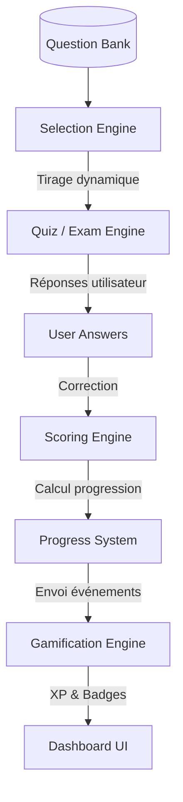

# System Overview — Le Volant Pour Tous

## 🎯 Objectif du document
Ce document décrit la vision globale et le fonctionnement end-to-end de la plateforme **Le Volant Pour Tous**, en reliant les 3 couches du système :
- Data System (questions & logique)
- Pedagogical Framework (cadre éducatif ETG / REMC)
- Product & UX Layer (expérience utilisateur)

---

## 🧠 1. Vue d’ensemble du système
La plateforme repose sur un flux de données strict reliant le contenu brut aux indicateurs d'apprentissage de l'utilisateur :



Chaque interaction utilisateur (quiz, examen blanc, jeu d’arcade) s’appuie sur la même base de données de questions (Question Bank), garantissant la cohérence scientifique, mais applique des règles d’utilisation et de sélection différentes.

---

## 📦 2. Data System (couche technique)
### 🎯 Rôle
Gérer toutes les données de contenu pédagogique.
### 📚 Contenu
- Question Bank (source unique de vérité)
- Modèle de question (id, thème ETG, réponses, bonne réponse, explication)
- Règles de sélection (quiz / examen)
- Stockage : JSON seed (V1) ou base PostgreSQL (Supabase + Prisma)
### 🔁 Cycle de vie des questions (V1)
1. Les questions sont définies dans un **fichier seed JSON**
2. Chargement dans l’application au build ou runtime
3. Utilisation directe dans quiz et examen blanc
4. Mise à jour manuelle par le développeur (pas d’admin panel en V1)

---

## 🎓 3. Pedagogical Framework (couche éducative)
### 🎯 Rôle
Définir le cadre officiel d’apprentissage.
### 📘 Contenu
- REMC (Référentiel Éducation Mobilité Citoyenne)
- ETG (10 thèmes officiels de l’examen)
- Modèle GADGET (comportement du conducteur)
- Mapping des 12 modules pédagogiques
### 📌 Principe clé
Les questions ne sont pas créées arbitrairement :
> Elles sont alignées sur les exigences officielles de l’ETG français.

---

## 🎨 4. Product & UX Layer (couche expérience utilisateur)
### 🎯 Rôle
Définir comment l’utilisateur interagit avec le système.
### 📱 Interfaces principales
- `/quiz` → entraînement rapide
- `/examen` → simulation officielle (40 questions)
- `/dashboard` → suivi progression + VolantReady™
- `/jeu` → gamification (signs, arcade, réflexes)
- `/cours` → apprentissage théorique
### 🔄 Logique utilisateur
- L’utilisateur consomme du contenu pédagogique
- Répond à des questions issues du Question Bank
- Gagne de la progression (XP, validation modules)
- Suit sa performance via dashboard

---

## 🧩 5. Relation entre les 3 couches
### 🔗 Flux global

```
[Pedagogy Layer]
       ↓
Defines rules & structure

[Data System]
       ↓
Provides questions based on rules

[Product Layer]
       ↓
Delivers UX to user
       ↓
Tracks progress back into system
```

---

## 🔁 6. Quiz vs Examen Blanc (logique système)

> [!NOTE]
> **Le mode Quiz et le mode Examen partagent exactement la même banque de questions (Question Bank), mais diffèrent par leurs règles de sélection et d'enchaînement.**

### 📘 Quiz
- Utilise la Question Bank complète
- Sélection aléatoire ou par thème
- Répétition possible des questions
- Objectif : apprentissage progressif
### 🧪 Examen Blanc
- Utilise la même Question Bank
- Sélection contrôlée (40 questions)
- Répartition équilibrée selon les 10 thèmes ETG
- Pas de répétition dans une session
- Objectif : simulation officielle

---

## 🧮 7. Moteurs Techniques Complémentaires

### 🧾 7.1 Moteur de Correction (Scoring Engine)
* **Entrées** : Choix de réponses soumis par l'utilisateur + Clé de validation des réponses correctes de la Question Bank.
* **Sorties** :
  - Score brut d'examen (sur 40) ou de quiz (pourcentage de réussite).
  - Identification des questions ratées (`mistakes`) au format JSON pour enregistrement.
  - Classification thématique de la maîtrise de l'élève (Radar du Dashboard).

### 🎮 7.2 Moteur de Récompenses (Gamification Engine)
* **Entrées** : Résultats bruts calculés par le Scoring Engine et validation de chapitres du Progress System.
* **XP Rules (Version V1)** :
  - **Quiz de fin de module** : `+1 XP` par bonne réponse.
  - **Examen Blanc** : `+50 XP` en cas de réussite ($\ge$ 35/40) + `+1 XP` par bonne réponse.
  - **Module validé ($\ge$ 80%)** : `+100 XP` à la première complétion.
* **Déblocage de Badges** : Analyse après chaque événement (ex: Badge "Perfect Exam" déclenché si score de session = 40/40, Badge "First Quiz" au premier quiz validé).

---

## 💾 8. Données utilisateur & Synchronisation (Progress System)

### 📌 Sources de données
- `localStorage` → Cache local de l'utilisateur invité (hors-connexion).
- Supabase PostgreSQL (via Prisma) → Base cloud sécurisée de l'utilisateur connecté.

### 🔄 Synchronisation
- **Fusion automatique** à la première authentification de l'élève.
- **Priorité au cloud** en cas de conflit de données pour assurer l'intégrité de la progression.

---

## 🚪 9. Entrée du système
Le point d’entrée logique de la plateforme est :
> `/dashboard` (pour un utilisateur connecté)  
> `/cours` (pour un visiteur invité)  

Tous les autres modules sont des extensions fonctionnelles greffées sur ces deux états.

---

## 🔐 10. Règles de Cohérence Stricte
- **Règle 1 — Source Unique de Vérité** : Aucune question ou métadonnée pédagogique ne peut exister en dehors du fichier de configuration centralisé (Question Bank).
- **Règle 2 — Séparation des Responsabilités (Clean Architecture)** :
  - *Data System* = Stockage et calcul logique.
  - *Pedagogical Framework* = Cadres réglementaires et didactiques.
  - *Product & UX Layer* = Présentation, interfaces et micro-animations.
- **Règle 3 — Zéro Logique Cachée** : Toutes les règles de sélection, de calcul de score, d'XP ou de déblocage de badges sont documentées de façon transparente.

---

## ⚠️ 11. Gestion des Edge Cases (Cas Limites)
- **Refresh durant examen** : L'état d'avancement est stocké temporairement dans le `localStorage` (`exam_recovery`). Le rechargement de page ne pénalise pas l'utilisateur et reprend à la question en cours.
- **Visiteur non inscrit** : Progression conservée localement. L'inscription n'efface rien mais fusionne les scores dans PostgreSQL.
- **Connexion multi-appareils** : La session active écrase le cache local de l'appareil courant pour éviter toute dérive de progression.

---

## 🧭 Résumé
Le système est conçu autour d’un principe unique :
> **Une seule base de questions → deux modes de sélection → un moteur de scoring → un système de progression → une couche gamification → un dashboard.**
